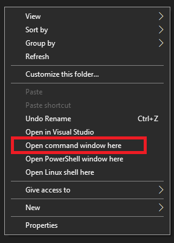

# cmd.exe in the shell extensions
This small tool allows the user to regain the option
to open the cmd shell from the directories and directories background.

Basically, after running the tool, you can Shift+Right Click any directory or directory background
and open a cmd shell from the same directory.

